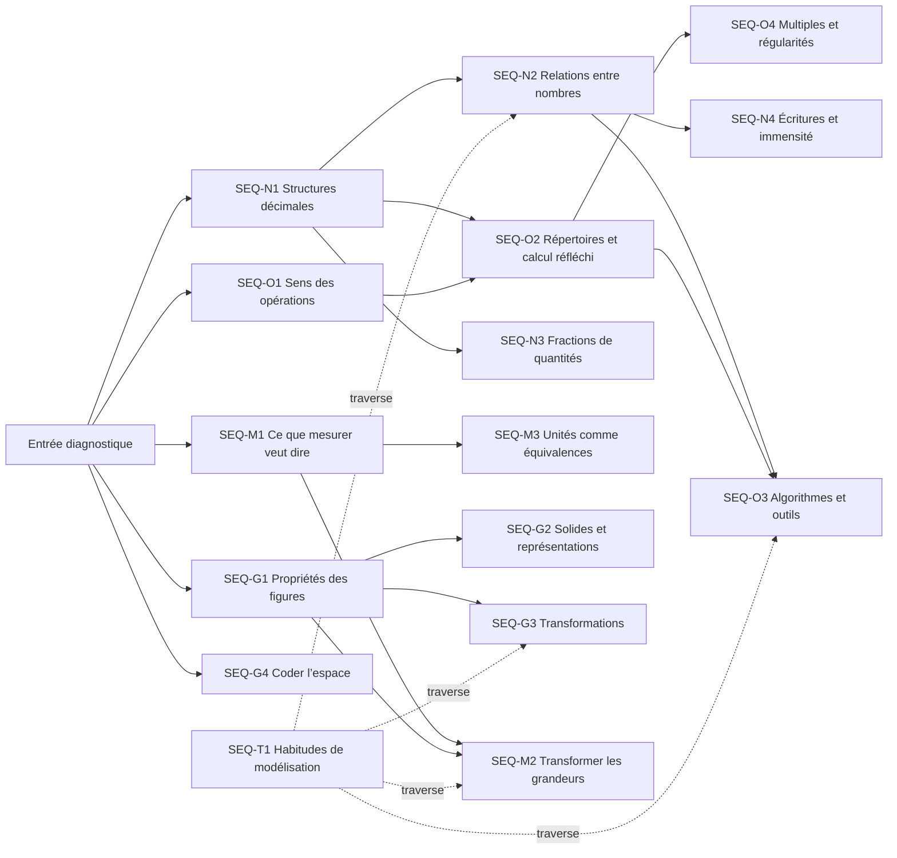

# Mathématiques 6H — roadmap conceptuelle

> **Statut global : proposition structurelle non approuvée, avec décisions bornées.** Le 2026-07-16, le propriétaire a approuvé la spine révisée `SEQ-N2 = NUM-02 → NUM-05 → NUM-06`, puis rejeté les trois directions mécaniques `NUM-02` et mis ce checkpoint en pause sans révoquer la spine. Le même jour, il a désigné `MES-01 → MES-02` comme pilote actif borné du workflow révisé, puis approuvé sa spine `r0-bounded-measurement-pair`. Cette approbation bornée n’approuve ni la spine complète `SEQ-M1`, ni le contrat d’apprentissage `MES-01`, ni une mécanique, un graybox catalogue ou une expansion. Le calendrier global et toute autre portée restent non approuvés.

## 1. Autorité et limites

- **Source normative :** PER Cycle 2 v3.0, MSN 21–25, `src-per-0002`, pages imprimées 8–29.
- **Inventaire utilisé :** 53 progressions 5H–6H et 19 attentes explicitement marquées 6e, toutes mappées dans ce roadmap.
- **Règle d’honnêteté :** les attentes `EC-*` non millésimées restent directionnelles; elles ne deviennent pas des seuils 6H.
- **Limite importante :** le PER publie une colonne commune 5e–6e, pas une liste normative séparée de fin 5H. L’entrée ci-dessous est donc un diagnostic de conception à confirmer par le propriétaire/enseignant, pas une citation officielle.
- **Ordre proposé :** les phases et semaines sont une hypothèse de progression, pas un calendrier CIIP obligatoire.
- **Décision bornée historique :** périmètre et spine `SEQ-N2 = NUM-02, NUM-05, NUM-06`; preuves `NUM-01`/`NUM-04` importées sans autorité de mécanique; `NUM-07` déplacé dans `SEQ-N1` sans autorité de production. Gate enregistré dans [`SEQ-N2/SEQUENCE-SPINE.md`](../../design/sequences/seq-n2/SEQUENCE-SPINE.md). `NUM-02` est maintenant en pause.
- **Pilote actif borné :** paire de conception `MES-01 → MES-02` seulement. Sa spine bornée `r0-bounded-measurement-pair` est approuvée; le prochain gate porte uniquement sur le contrat d’apprentissage précis de `MES-01`, pas sur une mécanique.

Sources : [`6h-mathematics-coverage.md`](../research/6h-mathematics-coverage.md) · [`src-per-0002.md`](../sources/src-per-0002.md) · [stratégie de production](../../design/6h-exercise-production-strategy-decision-record.draft.md)

## 2. Lecture rapide

- **5 strands :** Nombres et numération, Opérations et relations, Grandeurs et mesures, Espace et géométrie, Modélisation transversale.
- **16 séquences conceptuelles**, dont une transversale.
- **46 checkpoints observables**, chacun avec dépendances, preuve attendue et idée d’exercice.
- **Unité de cohérence :** une séquence entière avec progression et handoffs explicites.
- **Unité de prototypage mécanique :** un exercice-checkpoint à la fois, avec gate propriétaire propre.
- **Pilote actif :** éprouver le workflow `contrat d’apprentissage → tâches établies → argument de fit sémantique → graybox catalogue` sur la paire bornée `MES-01 → MES-02`. Aucun livrable aval n’est préapprouvé.

## 3. Entrée diagnostique proposée

Ces sondes déterminent les reprises nécessaires. Elles ne bloquent pas l’accès au catalogue et ne prétendent pas définir officiellement la fin 5H.

| ID | Domaine | Sonde courte | Statut |
|---|---|---|---|
| `EB-N` | Nombres | Lire, écrire, décomposer et représenter quelques naturels familiers; organiser un comptage simple. | hypothèse de conception |
| `EB-O` | Opérations | Interpréter addition/soustraction et groupes égaux dans des situations simples; expliquer au moins une stratégie. | hypothèse de conception |
| `EB-M` | Mesure | Comparer des longueurs et utiliser une unité ou une règle avec aide limitée. | hypothèse de conception |
| `EB-G` | Espace | Reconnaître quelques figures usuelles, suivre un trajet simple et employer des positions relatives. | hypothèse de conception |
| `EB-R` | Raisonnement | Reformuler une question, essayer, vérifier et expliquer brièvement. | hypothèse de conception |

## 4. Pacing suggéré

| Phase | Fenêtre | Fonction |
|---|---|---|
| `P0` Entrée diagnostique | semaines 1–2 | Observer les acquis attendus de fin 5H sans les présumer; ouvrir des reprises ciblées. |
| `P1` Fondations communes | semaines 3–9 | Stabiliser représentations, unités, sens des opérations et langage spatial. |
| `P2` Relations et stratégies | semaines 10–18 | Relier les représentations, construire des stratégies et expliciter les invariants. |
| `P3` Procédures et structures | semaines 19–29 | Institutionnaliser procédures, régularités, transformations et conversions sans perdre le sens. |
| `P4` Convergences et consolidation | semaines 30–36 | Mobiliser plusieurs strands, vérifier les 19 points d’arrivée explicites 6H et reprendre les dépendances fragiles. |

## 5. Carte des séquences

## 6. Séquences et checkpoints

### Nombres et numération

#### `SEQ-N1` — Structures décimales · P1

**Arc :** Du groupement matériel au nombre écrit et aux changements d’échelle de comptage.

| Nœud | Checkpoint observable | Dépendances | Idée d’exercice provisoire | PER |
|---|---|---|---|---|
| `NUM-01` **Regrouper pour dénombrer** | Organise une collection en unités, dizaines, centaines ou milliers et conserve le cardinal pendant les échanges. | entrée | Atelier de regroupement: construire puis compresser une collection en paquets de 10/100 sans changer sa quantité. | `P22.02` `P22.04` `E6-22.01` `E6-22.02` |
| `NUM-03` **Changer de pas dans une suite** | Compte et décompte depuis n’importe quel nombre par pas de 1, 10, 100 puis 1’000. | `NUM-01` | Sauts calibrés: choisir un pas puis anticiper l’atterrissage sur une ligne qui zoome aux changements de rang. | `P22.05` `E6-22.03` |
| `NUM-04` **Relier quantité, oral, chiffres et décomposition** | Coordonne groupements, nom oral, écriture chiffrée et décomposition de position. | `NUM-01` | Transformateur de nombres: échanger des blocs et voir simultanément évoluer nom, chiffres et décomposition. | `P22.11` `P22.12` `P22.13` `E6-22.05` `E6-22.06` |
| `NUM-07` **Transformer un rang sans perdre le nombre** | Anticipe l’effet de ±1/10/100/1’000 et des relations dix ou cent fois plus. | `NUM-03`, `NUM-04` | Console de valeur de position: actionner un seul levier et prévoir quels chiffres et groupements doivent changer. | `P22.09` `P22.10` |

> **Placement de `NUM-07` révisé par le propriétaire le 2026-07-16.** Ce déplacement ferme l’arc conceptuel de `SEQ-N1`; il n’approuve pas son exercice, sa mécanique ou la production de `SEQ-N1`.

#### `SEQ-N2` — Relations entre nombres · P2

> **Périmètre borné et spine révisée approuvés le 2026-07-16, puis mis en pause au checkpoint `NUM-02`.** La spine comprend `NUM-02`, `NUM-05`, `NUM-06`, avec `NUM-01` et `NUM-04` comme preuves préalables importées seulement. Le propriétaire a rejeté A/B/C pour objectif d’apprentissage insuffisamment clair et fit sémantique faible; le comparateur temporaire a été supprimé. Aucun script, exercice catalogue, mécanisme ou expansion `NUM-02` n’est autorisé.

**Arc :** Des repères approximatifs à l’ordre exact, puis à l’intervalle et à la localisation sur une ligne graduée.

| Nœud | Checkpoint observable | Dépendances | Idée d’exercice provisoire | PER |
|---|---|---|---|---|
| `NUM-02` **Estimer avec des repères** | Encadre une quantité avant comptage en s’appuyant sur des collections repères. | `NUM-01` | **En pause :** A/B/C rejetés; reformuler le contrat d’apprentissage avant toute nouvelle piste. | `P22.03` |
| `NUM-05` **Comparer et ordonner par valeur de position** | Compare, ordonne, encadre et intercale des naturels en justifiant le premier rang décisif. | `NUM-04` | Duel des rangs: révéler les chiffres de gauche à droite jusqu’au rang qui décide, puis construire un intrus entre deux bornes. | `P22.07` `E6-22.04` |
| `NUM-06` **Localiser un nombre sur une ligne** | Utilise bornes et intervalles pour placer ou lire un nombre sur une bande numérique. | `NUM-05` | Nombre caché: resserrer un intervalle sur une ligne graduée en choisissant des bornes informatives. | `P22.08` |

#### `SEQ-N3` — Fractions de quantités · P3

**Arc :** Partager et recomposer une quantité avant toute écriture fractionnaire formelle.

| Nœud | Checkpoint observable | Dépendances | Idée d’exercice provisoire | PER |
|---|---|---|---|---|
| `NUM-08` **Prendre une fraction d’une quantité** | Interprète moitié, tiers, quart, trois quarts ou dixième comme partage égal puis sélection de parts. | `NUM-01`, `OPS-02` | Table de partage: répartir une collection de plusieurs façons et tester quelles répartitions rendent la fraction possible. | `P22.14` |

#### `SEQ-N4` — Écritures et immensité des nombres · P3

**Arc :** Comprendre que les règles d’écriture permettent de prolonger et comparer des systèmes de numération.

| Nœud | Checkpoint observable | Dépendances | Idée d’exercice provisoire | PER |
|---|---|---|---|---|
| `NUM-09` **Prolonger la structure vers le très grand** | Comprend que les groupements de base dix se prolongent au-delà des nombres travaillés. | `NUM-04`, `NUM-07` | Échelle sans fin: zoomer de mille en mille et choisir le prochain regroupement plutôt qu’un dernier nombre. | `P22.06` |
| `NUM-10` **Décoder un système de numération** | Distingue la quantité représentée des conventions utilisées pour l’écrire. | `NUM-04` | Code retrouvé: comparer plusieurs inscriptions et déduire les règles minimales d’une numération. | `P22.15` |

### Opérations et relations

#### `SEQ-O1` — Donner du sens aux opérations · P1

**Arc :** Faire varier les relations entre quantités avant de choisir et écrire une opération.

| Nœud | Checkpoint observable | Dépendances | Idée d’exercice provisoire | PER |
|---|---|---|---|---|
| `OPS-01` **Modéliser addition et soustraction** | Reconnaît transformation, réunion, comparaison et complément sans se fier à un mot-clé. | `NUM-04` | Histoires jumelles: modifier une seule relation entre quantités et observer pourquoi l’opération change. | `P23.01` `E6-23.01` |
| `OPS-02` **Modéliser multiplication et partage** | Reconnaît groupes égaux, produit cartésien, produit de mesures et situations de partage/itération. | `NUM-01` | Constructeur de groupes: faire varier nombre et taille des groupes et prédire l’effet sur le total. | `P23.01` `E6-23.01` |
| `OPS-03` **Traduire et contrôler une situation** | Associe situation, représentation et écriture mathématique puis juge la plausibilité du résultat. | `OPS-01`, `OPS-02` | Décodeur d’équations: relier une scène quantitative à plusieurs écritures proches puis défendre la seule relation cohérente. | `P23.01` `E6-23.02` |

#### `SEQ-O2` — Répertoires et calcul réfléchi · P2

**Arc :** Construire les faits et stratégies par relations, décompositions et invariants.

| Nœud | Checkpoint observable | Dépendances | Idée d’exercice provisoire | PER |
|---|---|---|---|---|
| `OPS-04` **Construire le répertoire soustractif** | Retrouve et automatise les différences 0−0 à 19−9 par compléments et relations. | `OPS-01`, `NUM-03` | Pont des différences: construire des sauts complémentaires et réutiliser un pont connu pour un fait voisin. | `P23.11` `E6-23.06` |
| `OPS-05` **Construire le répertoire multiplicatif** | Retrouve et automatise les produits 0×0 à 9×9 par tableaux, doubles et décompositions. | `OPS-02` | Constellations rectangulaires: couper, retourner ou doubler un tableau pour fabriquer un fait à partir d’un autre. | `P23.12` `E6-23.06` |
| `OPS-06` **Choisir une stratégie de calcul réfléchi** | Utilise commutativité, associativité et décomposition pour calculer ou estimer efficacement. | `NUM-04`, `OPS-04`, `OPS-05` | Même résultat, autre chemin: transformer une expression par déplacements et décompositions autorisés. | `P23.08` `P23.09` |

#### `SEQ-O3` — Algorithmes et outils contrôlés · P3

**Arc :** Relier chaque procédure écrite ou instrumentale à une estimation et à la valeur de position.

| Nœud | Checkpoint observable | Dépendances | Idée d’exercice provisoire | PER |
|---|---|---|---|---|
| `OPS-07` **Comprendre les algorithmes additif et soustractif** | Relie chaque étape écrite à des échanges entre unités, dizaines et centaines. | `NUM-04`, `OPS-06` | Radiographie d’algorithme: manipuler les échanges sous chaque colonne et réparer une étape impossible. | `P23.10` `E6-23.04` |
| `OPS-08` **Comprendre la multiplication écrite par un chiffre** | Relie produits partiels et échanges de rang dans une multiplication par un facteur à un chiffre. | `NUM-04`, `OPS-05`, `OPS-06` | Convoyeur de produits partiels: suivre chaque quantité depuis les blocs jusqu’à sa colonne écrite. | `P23.10` `E6-23.05` |
| `OPS-11` **Utiliser la calculatrice sous contrôle** | Estime avant calcul, utilise les fonctions de base et accepte ou refuse l’affichage. | `NUM-05`, `OPS-03`, `OPS-06` | Tribunal de l’écran: estimer une zone de verdict puis enquêter sur des affichages plausibles ou impossibles. | `P23.02` `P23.03` `P23.04` |

#### `SEQ-O4` — Multiples et régularités · P3

**Arc :** Voir la périodicité avant de formuler critères et règles de suites.

| Nœud | Checkpoint observable | Dépendances | Idée d’exercice provisoire | PER |
|---|---|---|---|---|
| `OPS-09` **Voir les multiples et critères simples** | Reconnaît les multiples comme positions périodiques et explique les critères de 2, 5, 10, 100. | `OPS-05` | Signaux périodiques: superposer des rythmes de multiples et chercher ce que révèle le dernier rang. | `P23.05` `P23.06` |
| `OPS-10` **Détecter une règle de suite** | Reconnaît et complète une suite arithmétique en explicitant son pas. | `NUM-03`, `OPS-09` | Détective des cases manquantes: placer le minimum d’indices permettant d’identifier une règle unique. | `P23.07` `E6-23.03` |

### Grandeurs et mesures

#### `SEQ-M1` — Ce que mesurer veut dire · P1

> **Pilote actif borné au 2026-07-16 : `MES-01 → MES-02` seulement.** Sa spine `r0-bounded-measurement-pair` est approuvée; cela n’approuve pas toute la spine `SEQ-M1`, les idées ci-dessous, le contrat d’apprentissage `MES-01`, une mécanique ou une implémentation. `MES-04` et `MES-06` restent hors portée.

**Arc proposé de la séquence complète :** Construire l’étalon, estimer, comparer puis utiliser correctement la règle.

**Arc borné approuvé :** comprendre qu’une longueur se mesure en itérant la même unité bout à bout, puis mobiliser cette unité comme repère pour estimer avant de vérifier.

| Nœud | Checkpoint observable | Dépendances | Idée d’exercice provisoire | PER |
|---|---|---|---|---|
| `MES-01` **Construire et répéter une unité** | Comprend mesurer comme couvrir ou itérer une même unité sans trou ni chevauchement. | entrée | **Piste de tâche, non approuvée :** mesurer un chemin d’un pavé de large en répétant un pavé-étalon de 50 cm bout à bout, sans trou ni chevauchement. | `P24.02` `P24.06` |
| `MES-02` **Estimer avant de mesurer** | Choisit un repère de grandeur et formule une estimation contrôlable. | `MES-01` | **Piste de tâche, non approuvée :** prévoir le nombre de pavés et la longueur du chemin avant chantier, puis vérifier par itération et interpréter manque ou surplus. | `P24.03` |
| `MES-04` **Comparer des longueurs** | Compare des longueurs malgré orientation, courbure ou position différentes. | `MES-01` | Laboratoire des chemins: redresser, superposer ou reporter des parcours trompeurs. | `P24.06` `E6-24.01` |
| `MES-06` **Lire et utiliser une règle graduée** | Aligne le zéro, lit l’échelle, mesure ou trace un segment et communique un encadrement si nécessaire. | `MES-01`, `NUM-04` | Règle à pièges: diagnostiquer zéro décalé, graduation masquée et mesure par différence. | `P24.07` `E6-24.02` |

#### `SEQ-M2` — Transformer et calculer des grandeurs · P3

**Arc :** Relier fractionnement, conservation d’aire et périmètre par manipulation.

| Nœud | Checkpoint observable | Dépendances | Idée d’exercice provisoire | PER |
|---|---|---|---|---|
| `MES-03` **Doubler, tripler et fractionner une grandeur** | Relie transformations multiplicatives et fractionnement à une grandeur mesurable. | `NUM-08`, `OPS-02`, `MES-01` | Machine à échelle: transformer un segment ou une surface et prédire la nouvelle grandeur avant mesure. | `P24.04` `P24.05` |
| `MES-05` **Comparer des aires par conservation** | Compare des surfaces simples par pavage, découpage ou recomposition. | `MES-01`, `GEO-03` | Atelier de conservation: découper deux surfaces et recomposer un même gabarit sans ajouter ni retirer de pièce. | `P24.06` `E6-24.01` |
| `MES-07` **Construire le périmètre comme longueur totale** | Calcule longueur de trajet, ligne brisée ou périmètre en suivant chaque segment une fois. | `MES-06`, `OPS-01`, `GEO-01` | Clôtures mobiles: déformer une enceinte, prévoir ce qui change et choisir les segments nécessaires. | `P24.08` |

#### `SEQ-M3` — Unités comme équivalences · P2

**Arc :** Comprendre l’unité comme convention et les conversions comme équivalences.

| Nœud | Checkpoint observable | Dépendances | Idée d’exercice provisoire | PER |
|---|---|---|---|---|
| `MES-08` **Choisir et convertir des unités** | Choisit une unité adaptée et exprime une même grandeur par des unités équivalentes. | `MES-01`, `MES-06`, `NUM-07` | Ponts d’unités: assembler des barres équivalentes puis convertir sans changer la grandeur représentée. | `P24.02` `P24.09` `P24.11` `E6-24.03` |
| `MES-09` **Comprendre pourquoi les unités sont conventionnelles** | Compare des unités historiques ou culturelles et explique le besoin d’une référence partagée. | `MES-01` | Marché des mesures: résoudre un désaccord créé par des pieds/coudées différents puis négocier un étalon commun. | `P24.10` |

### Espace et géométrie

#### `SEQ-G1` — Propriétés des figures · P1–P2

**Arc :** Passer de la reconnaissance visuelle aux propriétés, compositions et constructions contraintes.

| Nœud | Checkpoint observable | Dépendances | Idée d’exercice provisoire | PER |
|---|---|---|---|---|
| `GEO-01` **Classer les figures par propriétés** | Reconnaît et nomme triangle, carré, rectangle, losange et cercle malgré orientation ou aspect atypique. | entrée | Portrait-robot de figures: poser des questions de propriétés pour identifier une figure mystère. | `P21.02` `E6-21.01` |
| `GEO-02` **Reconnaître parallèle et perpendiculaire** | Distingue parallélisme et perpendicularité indépendamment de l’orientation et de la longueur des segments. | `GEO-01` | Rails et lasers: ajuster des droites, prolonger leur trajectoire et prédire intersection ou angle droit. | `P21.06` |
| `GEO-03` **Décomposer et recomposer une surface** | Voit une surface comme assemblage transformable de formes élémentaires. | `GEO-01` | Chirurgie de formes: couper une silhouette selon peu de traits puis atteindre une autre silhouette avec les mêmes pièces. | `P21.03` |
| `GEO-04` **Passer du croquis à la construction contrainte** | Utilise un croquis pour planifier puis une règle graduée pour achever carré ou rectangle. | `GEO-01`, `GEO-02`, `MES-06` | Plan à contraintes: compléter le minimum de traits pour rendre une figure inévitable, puis la vérifier. | `P21.04` `P21.05` `E6-21.02` |

#### `SEQ-G2` — Du solide à ses représentations · P2

**Arc :** Coordonner objet, faces, développement et points de vue.

| Nœud | Checkpoint observable | Dépendances | Idée d’exercice provisoire | PER |
|---|---|---|---|---|
| `GEO-05` **Décrire un solide par ses éléments** | Reconnaît cube, pyramide et pavé droit par faces, arêtes et sommets. | entrée | Scanner de solides: tourner un objet et marquer les éléments nécessaires à une identification sans le nommer. | `P21.07` |
| `GEO-06` **Relier solide, construction et développement** | Prédit quelles faces se rejoignent et construit un solide répondant à des critères. | `GEO-05`, `GEO-03` | Pliage prédit: choisir deux arêtes censées se rencontrer, puis déclencher le pliage pour tester. | `P21.08` `P21.09` |
| `GEO-07` **Interpréter une perspective** | Relie une représentation en perspective à la structure d’un solide ou assemblage. | `GEO-05` | Décodeur de points de vue: faire tourner un assemblage minimal pour retrouver la perspective compatible. | `P21.10` |

#### `SEQ-G3` — Transformations et invariants · P3

**Arc :** Identifier ce qui change et ce qui reste invariant pour produire et reproduire.

| Nœud | Checkpoint observable | Dépendances | Idée d’exercice provisoire | PER |
|---|---|---|---|---|
| `GEO-08` **Identifier les invariants d’une isométrie** | Distingue ce qui change (position/orientation) de ce qui reste invariant (forme, longueurs, angles). | `GEO-01` | Laboratoire “qu’est-ce qui survit?”: appliquer un mouvement puis parier sur les propriétés conservées. | `P21.11` |
| `GEO-09` **Produire frises et pavages par règle** | Prolonge un motif en appliquant la même isométrie et explique la règle. | `GEO-08` | Moteur de motif: régler une transformation puis repérer la première rupture dans une frise ou un pavage. | `P21.12` |
| `GEO-10` **Déterminer les axes de symétrie** | Teste si un pli superpose réellement les deux parties, y compris pour axes obliques. | `GEO-08` | Test du miroir: déplacer un miroir virtuel et voir quelles paires de points doivent coïncider. | `P21.13` |
| `GEO-11` **Reproduire par translation ou symétrie** | Construit l’image point par point en respectant déplacement ou distance à l’axe. | `GEO-08`, `GEO-10` | Machine à copier: programmer un mouvement unique puis réparer les points qui violent la règle. | `P21.14` |

#### `SEQ-G4` — Coder et lire l’espace · P1

**Arc :** Transformer un trajet ou une position relative en message vérifiable.

| Nœud | Checkpoint observable | Dépendances | Idée d’exercice provisoire | PER |
|---|---|---|---|---|
| `GEO-12` **Coder un itinéraire et des positions relatives** | Crée, suit et vérifie un code de trajet; situe des objets les uns par rapport aux autres sur un plan. | entrée | Messager de parcours: écrire le minimum de commandes non ambiguës, puis observer un agent les exécuter littéralement. | `P21.15` `E6-21.03` `E6-21.04` |

### Modélisation transversale

#### `SEQ-T1` — Habitudes de modélisation · P1–P4

**Arc :** Rituels transversaux répétés dans les autres séquences, jamais un chapitre isolé.

| Nœud | Checkpoint observable | Dépendances | Idée d’exercice provisoire | PER |
|---|---|---|---|---|
| `MOD-01` **Cadrer et organiser un problème** | Distingue question, données utiles, données superflues et information manquante. | entrée | Tamis d’informations: déplacer chaque donnée vers utile, superflue ou manquante puis tester si le problème devient solvable. | `P21.01` `P22.01` `P23.01` `P24.01` |
| `MOD-02` **Conjecturer, tester et réviser** | Formule une prédiction, choisit un cas informatif et révise après contre-exemple. | `MOD-01` | Laboratoire de conjectures: choisir le cas qui discrimine deux règles possibles puis réviser la règle. | `P21.01` `P22.01` `P23.01` `P24.01` |
| `MOD-03` **Valider par contraintes et ordre de grandeur** | Accepte ou refuse un résultat à partir des contraintes, d’un calcul inverse ou d’un ordre de grandeur. | `MOD-01`, `NUM-05`, `MES-02` | Inspecteur de résultats: sélectionner le contrôle le moins coûteux capable de démasquer une réponse impossible. | `P21.01` `P22.01` `P23.01` `P24.01` |
| `MOD-04` **Communiquer une démarche vérifiable** | Présente représentations, étapes et conclusion avec vocabulaire et symboles compréhensibles. | `MOD-01` | Relecture de raisonnement: ordonner traces, supprimer les étapes décoratives et enregistrer une justification courte. | `P21.01` `P22.01` `P23.01` `P24.01` |

## 7. Convergences inter-strands

| ID | Phase | Convergence | Prérequis | Preuve attendue |
|---|---|---|---|---|
| `C1` | P2 | Quantité ↔ écriture ↔ opération | `SEQ-N1`, `SEQ-O1` | Représenter une même situation par groupements, nombre, schéma et opération cohérents. |
| `C2` | P3 | Géométrie ↔ mesure | `SEQ-G1`, `SEQ-M1` | Construire ou comparer une figure en mobilisant propriétés, règle et unités sans confondre aire et contour. |
| `C3` | P4 | Choix d’outil et validation | `SEQ-N2`, `SEQ-O2`, `SEQ-O3`, `SEQ-M3`, `SEQ-T1` | Choisir représentation, calcul ou mesure; produire un résultat; le contrôler et communiquer la démarche. |
| `C4` | P4 | Transformation et structure | `SEQ-N3`, `SEQ-O4`, `SEQ-M2`, `SEQ-G3` | Reconnaître une structure conservée sous changement de valeur, d’échelle, de forme ou de position. |

## 8. Points d’arrivée explicitement 6H

Les 19 attentes `E6-*` constituent les seuls points d’arrivée annuels explicitement marqués 6e par la source. Leur présence dans un nœud ne valide pas encore le nœud; elle indique où la preuve devra être construite.

| Point 6H | Nœud(x) responsable(s) |
|---|---|
| `E6-21.01` | `GEO-01` |
| `E6-21.02` | `GEO-04` |
| `E6-21.03` | `GEO-12` |
| `E6-21.04` | `GEO-12` |
| `E6-22.01` | `NUM-01` |
| `E6-22.02` | `NUM-01` |
| `E6-22.03` | `NUM-03` |
| `E6-22.04` | `NUM-05` |
| `E6-22.05` | `NUM-04` |
| `E6-22.06` | `NUM-04` |
| `E6-23.01` | `OPS-01`, `OPS-02` |
| `E6-23.02` | `OPS-03` |
| `E6-23.03` | `OPS-10` |
| `E6-23.04` | `OPS-07` |
| `E6-23.05` | `OPS-08` |
| `E6-23.06` | `OPS-04`, `OPS-05` |
| `E6-24.01` | `MES-04`, `MES-05` |
| `E6-24.02` | `MES-06` |
| `E6-24.03` | `MES-08` |

## 9. Contrôle de couverture des progressions 5H–6H

Le JSON canonique contient le détail. Contrôle effectué lors de la génération :

- Progressions attendues : **53**; mappées : **53**; non mappées : **0**.
- Points explicites 6H attendus : **19**; mappés : **19**; non mappés : **0**.
- Chaque dépendance pointe vers un checkpoint existant.
- Chaque checkpoint possède une preuve observable et une idée d’exercice provisoire.

Mapping statement → checkpoint

| Énoncé | Checkpoint(s) |
|---|---|
| `P21.01` | `MOD-01`, `MOD-02`, `MOD-03`, `MOD-04` |
| `P21.02` | `GEO-01` |
| `P21.03` | `GEO-03` |
| `P21.04` | `GEO-04` |
| `P21.05` | `GEO-04` |
| `P21.06` | `GEO-02` |
| `P21.07` | `GEO-05` |
| `P21.08` | `GEO-06` |
| `P21.09` | `GEO-06` |
| `P21.10` | `GEO-07` |
| `P21.11` | `GEO-08` |
| `P21.12` | `GEO-09` |
| `P21.13` | `GEO-10` |
| `P21.14` | `GEO-11` |
| `P21.15` | `GEO-12` |
| `P22.01` | `MOD-01`, `MOD-02`, `MOD-03`, `MOD-04` |
| `P22.02` | `NUM-01` |
| `P22.03` | `NUM-02` |
| `P22.04` | `NUM-01` |
| `P22.05` | `NUM-03` |
| `P22.06` | `NUM-09` |
| `P22.07` | `NUM-05` |
| `P22.08` | `NUM-06` |
| `P22.09` | `NUM-07` |
| `P22.10` | `NUM-07` |
| `P22.11` | `NUM-04` |
| `P22.12` | `NUM-04` |
| `P22.13` | `NUM-04` |
| `P22.14` | `NUM-08` |
| `P22.15` | `NUM-10` |
| `P23.01` | `OPS-01`, `OPS-02`, `OPS-03`, `MOD-01`, `MOD-02`, `MOD-03`, `MOD-04` |
| `P23.02` | `OPS-11` |
| `P23.03` | `OPS-11` |
| `P23.04` | `OPS-11` |
| `P23.05` | `OPS-09` |
| `P23.06` | `OPS-09` |
| `P23.07` | `OPS-10` |
| `P23.08` | `OPS-06` |
| `P23.09` | `OPS-06` |
| `P23.10` | `OPS-07`, `OPS-08` |
| `P23.11` | `OPS-04` |
| `P23.12` | `OPS-05` |
| `P24.01` | `MOD-01`, `MOD-02`, `MOD-03`, `MOD-04` |
| `P24.02` | `MES-01`, `MES-08` |
| `P24.03` | `MES-02` |
| `P24.04` | `MES-03` |
| `P24.05` | `MES-03` |
| `P24.06` | `MES-01`, `MES-04`, `MES-05` |
| `P24.07` | `MES-06` |
| `P24.08` | `MES-07` |
| `P24.09` | `MES-08` |
| `P24.10` | `MES-09` |
| `P24.11` | `MES-08` |

## 10. Gates d’autorité structurelle

### Gate global — encore ouvert

Pour produire hors d’une exception bornée, le propriétaire doit explicitement accepter ou corriger :

1. les cinq sondes d’entrée comme hypothèses raisonnables de début 6H;
2. les 46 checkpoints et leur granularité;
3. les dépendances et les 16 séquences;
4. le pacing suggéré;
5. chaque idée d’exercice comme piste, sans engagement de mécanique;
6. la ou les premières séquences autorisées.

Ce gate global reste ouvert. Il ne bloque pas une exception dont le périmètre est explicitement enregistré.

### Spine approuvée mais pilote en pause — `SEQ-N2 / NUM-02`

La spine `SEQ-N2` reste approuvée avec les preuves `NUM-01`/`NUM-04` importées sans production et `NUM-07` déplacé dans `SEQ-N1`. Les trois directions `NUM-02` et leur comparaison temporaire sont rejetées; aucun travail mécanique ne peut reprendre sans nouveau contrat d’apprentissage approuvé.

### Pilote actif borné — `MES-01 → MES-02`

La spine bornée `r0-bounded-measurement-pair` est approuvée. Cette décision autorise seulement le gate séparé du contrat d’apprentissage `MES-01`; elle ne vaut pas approbation de `SEQ-M1`, de `MES-04`/`MES-06`, du contrat lui-même, d’un candidat mécanique ou de code.

**Prochain gate :** approuver, corriger, renvoyer ou parquer le contrat d’apprentissage précis `MES-01` `r0-unit-iteration-contract` (phrase d’apprentissage centrale, énoncé de réussite et cognition attendue). Ce n’est qu’après son approbation que des tâches de classe établies et des arguments de fit sémantique pourront être proposés. Chaque candidat approuvé aura son propre exercice graybox catalogue et son propre gate `mechanic approved for expansion`.
