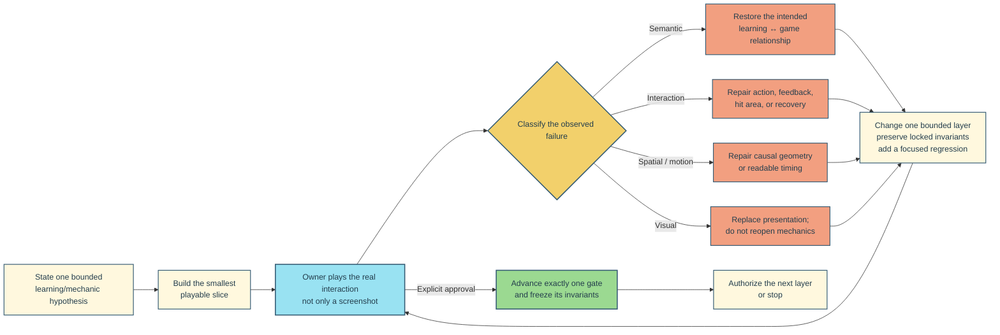

# EX-0007 — observed execution workflow

> **Purpose:** reconstruct the process that actually produced the completed EX-0007 prototype. This is a case study, not a claim that every future exercise must repeat every correction.
>
> **Evidence tags:** **[O]** direct owner observation, request, or approval · **[T]** technical evidence · **[S]** retrospective synthesis.

## One-screen reconstruction

```mermaid
flowchart TD
  classDef scope fill:#F2D06B,stroke:#345B73,color:#243E4D,stroke-width:2px;
  classDef build fill:#FFF8DE,stroke:#345B73,color:#243E4D,stroke-width:1.5px;
  classDef replay fill:#99E2F2,stroke:#345B73,color:#243E4D,stroke-width:2px;
  classDef correction fill:#F29F80,stroke:#345B73,color:#243E4D,stroke-width:1.5px;
  classDef gate fill:#9BD991,stroke:#345B73,color:#243E4D,stroke-width:2.5px;
  classDef technical fill:#E9F7F9,stroke:#345B73,color:#243E4D,stroke-width:1.5px;
  classDef open fill:#FFFFFF,stroke:#B85C57,color:#243E4D,stroke-width:2px,stroke-dasharray:6 4;

  A(["OWNER SCOPE [O]<br/>Number patterns + playable<br/>precedent adaptation"]):::scope

  subgraph M["MECHANIC DISCOVERY — repeated build → replay → bounded correction"]
    direction TB
    B["First 3-scene graybox [T]<br/>given +3 · inferred +5 · descending −7<br/>Sequence-only; race omitted"]:::build
    C{"Owner replay [O]<br/>Was the precedent's fun preserved?"}:::replay
    D["No — restore the essential causal race<br/>runner blocked before holes · flying rival continues<br/>timeout + same-course replay"]:::correction
    E{"Owner replay [O]<br/>Are the essential elements present<br/>without avoidable friction?"}:::replay
    F["Reduce friction<br/>auto-start · first-round hint only<br/>direct number placement"]:::correction
    G{"Owner replay + acceptance review [O/T]<br/>Is action → consequence readable?"}:::replay
    H["Ordered interaction corrections<br/>one real drop + 20 px halo · immediate repair<br/>visible runner · non-blocking error feedback"]:::correction
    I["Ordered motion/spatial corrections<br/>distance-based linear travel · one term-aligned path<br/>runner stops before, never on, the missing section"]:::correction
    J{"MECHANIC GATE [O]<br/>Race relationship validated?"}:::gate

    B --> C
    C -- "No: race removal was semantic loss" --> D
    D --> E
    E -- "Yes, but interaction was too indirect" --> F
    F --> G
    G -- "Drop / consequence defects" --> H
    H --> G
    G -- "Motion / geometry defects" --> I
    I --> G
    G -- "Explicit approval" --> J
  end

  subgraph P["PRESENTATION DISCOVERY — mechanics frozen while the surface changes"]
    direction TB
    K["Technical hardening after first polish [T]<br/>validated behavior moved behind a deep race model<br/>browser adapter + scoped CSS preserve the surface"]:::technical
    L["Bounded first polish<br/>Le Relais des Balises<br/>validated mechanic invariants frozen"]:::build
    M1{"Owner visual replay [O]"}:::replay
    N["Rejected: dark dashboard / nested panels<br/>Apply exact five-color palette + bright storybook art"]:::correction
    M2{"Owner visual replay [O]"}:::replay
    O["Rejected: too dense / tutorial misplaced / drag unclear<br/>Minimal copy + tutorial in round one + live drag follower"]:::correction
    M3{"Owner semantic-visual replay [O]"}:::replay
    Q["Rejected: signal objects do not form a traversable path<br/>Side-profile broken ground + runner feet on surface"]:::correction
    R{"Owner replay [O]<br/>Side-profile correction “perfect”?"}:::replay
    S["Full generated-art pass authorized<br/>3 locations · original couriers · modular terrain<br/>intro / success / victory / retry · reduced-motion fallbacks"]:::gate
    T["Final legibility correction [O]<br/>paper badges behind answer numerals"]:::correction
    U["Technical closeout [T]<br/>12/12 focused · 6/6 generic · build/check<br/>provenance hashes · desktop/mobile state matrices"]:::technical

    L --> K --> M1
    M1 -- "Rejected" --> N --> M2
    M2 -- "Rejected / revise" --> O --> M3
    M3 -- "Rejected / replace metaphor" --> Q --> R
    R -- "Approved; expand presentation only" --> S --> T --> U
  end

  V(["CURRENT CEILING<br/>Owner-approved, technically validated,<br/>polished prototype · status: prototyping"]):::gate
  W(["OPEN PROMOTION GATE<br/>Pupil reasoning vs guessing · tutorial comprehension<br/>race pressure · untimed/slower equivalent · sequence role"]):::open

  A --> B
  J --> L
  U --> V --> W
```

The important shape is not a single handoff from “idea” to “finished design.” EX-0007 advanced through two distinct replay loops:

1. **Mechanic discovery:** preserve the learning operation and the precedent’s essential fun.
2. **Presentation discovery:** keep the validated mechanic fixed while repeatedly replacing unclear visual explanations.

## Observed chronology

| Cycle | Observation or gate | Bounded response | What became locked |
|---|---|---|---|
| 1. Scope | **[O]** Owner chose a playable **number-pattern** adaptation rather than geometric or mixed patterns. | **[T]** Build three deterministic scenes: given `+3`, infer `+5`, transfer to descending `−7`. | Bounded standalone prototype; no roadmap attachment or production claim. |
| 2. Semantic correction | **[O]** Sequence completion alone had removed the source game’s fun. | Restore runner blocked before missing terms while a flying rival advances independently; add timeout and same-course replay. | The race relationship is part of the mechanic, while speed is not learning evidence. |
| 3. Friction correction | **[O]** Essential race elements were present, but rule confirmation and launch steps added friction. | Auto-start courses, retain only the first-round `+3` hint, and infer later steps through direct placement. | Direct mathematical action rather than a separate preliminary rule phase. |
| 4. Interaction correction | **[O]** A drag appeared to need two attempts; repaired state stayed stale; the runner did not visibly communicate the consequence. | One authoritative native drop, real 20 px target halo, immediate repaired term, recognizable runner, and automatic written/outlined error recovery. | One action must produce one immediate, inspectable consequence. |
| 5. Motion correction | **[O]** Fixed `620 ms` travel was too fast. **[T]** Review found the retained cubic easing still front-loaded the motion. | Use `max(650, distance × 18)` ms and linear `left` travel, with an `80 ms` reduced-motion update. | CSS and model timing share one constant-speed contract. |
| 6. Spatial correction | **[O]** Separate runner and number surfaces obscured the blockage; stopping on `?` treated an obstacle as a platform. | Make terms the ground path and align the rival lane to the same grid; stop on the preceding valid term. | Missing number → broken ground → blocked runner is one visible causal chain. |
| 7. Mechanic gate and hardening | **[O]** Owner validated the race mechanics and authorized only a bounded presentation pass, which first produced *Le Relais des Balises*. | Freeze scene values, timing, geometry, input methods, feedback, and accessibility behavior. **[T]** After that pass, move race invariants behind `current()` / `send(intent, nowMs)` and retain a thin browser adapter. | Presentation may change without reopening the validated race model. |
| 8. Art-direction correction | **[O]** The first polished surface was rejected as dark, nested, and dashboard-like. | Replace it with the exact owner palette and a bright, outlined fantasy-storybook treatment. | Light mode, palette, and broad illustration traits; no copied characters or composition. |
| 9. Density and instruction correction | **[O]** The storybook replacement had too much visible copy; the tutorial location and native drag feedback were unclear. | Remove redundant chrome, keep the intro minimal, teach only in the first active round, and show a DOM drag follower and landing response. | Form/state should explain objects; visible text is reserved for mathematics, necessary controls, and actionable feedback. |
| 10. Metaphor correction | **[O]** Signal objects still did not explain how the runner crossed the course. | Replace them with a side-profile landscape whose missing earth section falls below the breach; locally rebuild the stopwatch. | The mathematical repair and physical repair are the same on-screen event. |
| 11. Production-art authority | **[O]** Owner called the side-profile correction “perfect” and authorized the full visual pass. | Generate original locations, terrain, couriers, outcome art, and three-frame presentation cycles while keeping live HTML/model semantics. | Art is decorative; numbers, controls, timing, hit geometry, outcomes, and progression remain authoritative code. |
| 12. Final correction and closeout | **[O]** Soil texture competed with answer numerals. **[T]** Final focused/generic tests, build, asset hashes, reduced motion, and responsive state matrices passed. | Add paper numeral badges and rerun the bounded validation matrix. | Owner-approved polished prototype; promotion remains open. |

The detailed dated disposition ledger is in `experiments/src/exercises/ex-0007-number-pattern-graybox/DESIGN.md` under **Owner playtest and mechanic gate**.

## Reusable execution loop derived from the case

**[S]** This is the reusable part of EX-0007—not every rejected visual treatment or exact number of rounds.

### Operating rules inferred from EX-0007

1. **Observe causality, not taste alone.** “The runner seems to need two drops” and “the hole is an obstacle, not a platform” produced testable changes.
2. **Classify before revising.** Semantic, interaction, motion/spatial, and visual failures require different responses.
3. **Change one layer at a time.** Race restoration did not authorize expansion; mechanic approval did not authorize arbitrary mechanic drift; generated art followed metaphor approval.
4. **Freeze approved invariants explicitly.** Every later brief repeated the scene math, deadlines, stop geometry, input, recovery, accessibility, and reduced-motion constraints that could not move.
5. **Turn each correction into evidence.** Focused model/browser checks captured deadline ordering, travel timing, drop geometry, live feedback, responsive alignment, reduced motion, and asset provenance.
6. **Use natural-language approval, not inferred enthusiasm.** A clear owner disposition advanced the gate; technical success alone never did.
7. **Keep technical and learning claims separate.** Tests can show that the race behaves as authored. They cannot show that pupils infer intervals rather than guess under pressure.

## Gate ledger

| Gate | Meaning in this case | Result |
|---|---|---|
| Scope / graybox | Permission to build the chosen precedent adaptation. Not mechanic approval, roadmap attachment, expansion, or polish. | **Passed** |
| Mechanic | Owner replay confirms the blocked-runner / continuous-rival relationship and direct placement loop. | **Passed** |
| Presentation | Owner approves the side-profile broken-ground metaphor and authorizes generated-art polish. | **Passed for prototype polish** |
| Technical | Authored behavior, accessibility, responsive geometry, reduced motion, build, and provenance pass their checks. | **Passed** |
| Pupil / promotion | Pupils demonstrate interval reasoning; timer pressure, tutorial comprehension, and an untimed/slower equivalent are resolved. | **Open** |
| Sequence integration | Exercise receives an approved role in a production sequence and learning contract. | **Open** |

## Evidence ceiling

EX-0007 is an **owner-approved, technically validated, polished prototype**. Its catalog metadata still says `status: 'prototyping'`. It is not attached to an approved roadmap sequence and has no pupil evidence establishing learning, tutorial comprehension, or suitable race pressure. The observed process therefore ends at a successful prototype gate—not at production or efficacy approval.

## Primary evidence

- `experiments/src/exercises/ex-0007-number-pattern-graybox/DESIGN.md`
  - **Workflow provenance**
  - **Owner playtest and mechanic gate**
  - **Strategic implementation design**
  - **Validation evidence**
  - **Generated-asset production pass**
  - **Promotion criteria**
- `experiments/src/exercises/ex-0007-number-pattern-graybox/exercise.ts` — catalog status and mechanic metadata.
- `experiments/tests/smoke/ex-0007-race-model.spec.ts` — model invariants, timing, timeout, deadline, progression, and reduced motion.
- `experiments/tests/smoke/ex-0007-drag-runner.spec.ts` — DOM interaction, drag halo/follower, visual geometry, generated assets, responsive layout, keyboard, and reduced motion.
- `.pi/memory/pending/*ex-0007*` — timestamped owner decisions and superseding dispositions.
- `experiments/design/prototype-production-workflow.md` — comparison source for gate meanings and the rule that technical checks cannot claim pupil learning.

## Historical deviation worth preserving

**[O/T/S]** EX-0007 began as a standalone precedent adaptation without an approved sequence spine or separate learning brief; its local learning contract lived in `DESIGN.md`. It also did not compare three competing mechanic pitches after the owner had already selected this precedent. The honest reusable lesson is therefore the **bounded build → owner replay → classified correction → focused evidence → narrow gate** loop, not a claim that the idealized upstream workflow occurred in full.
